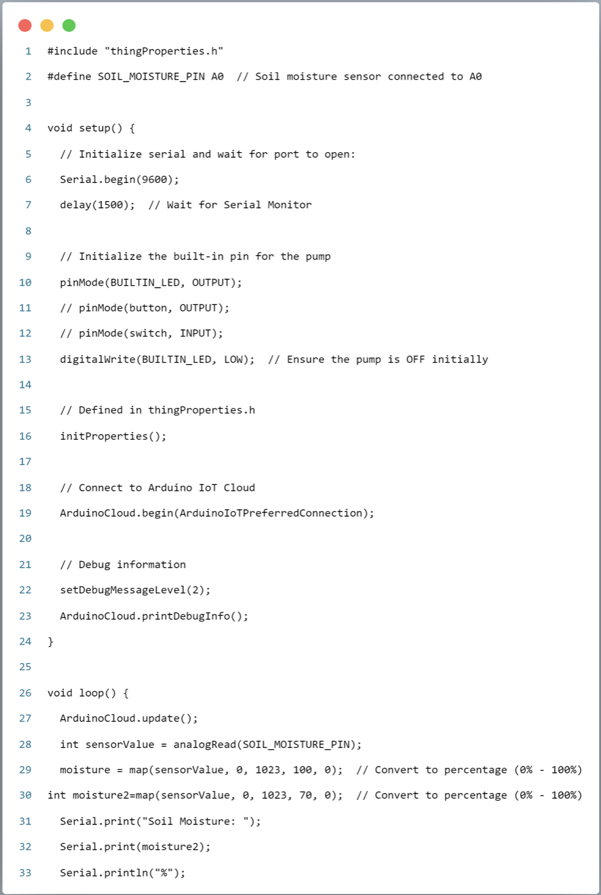
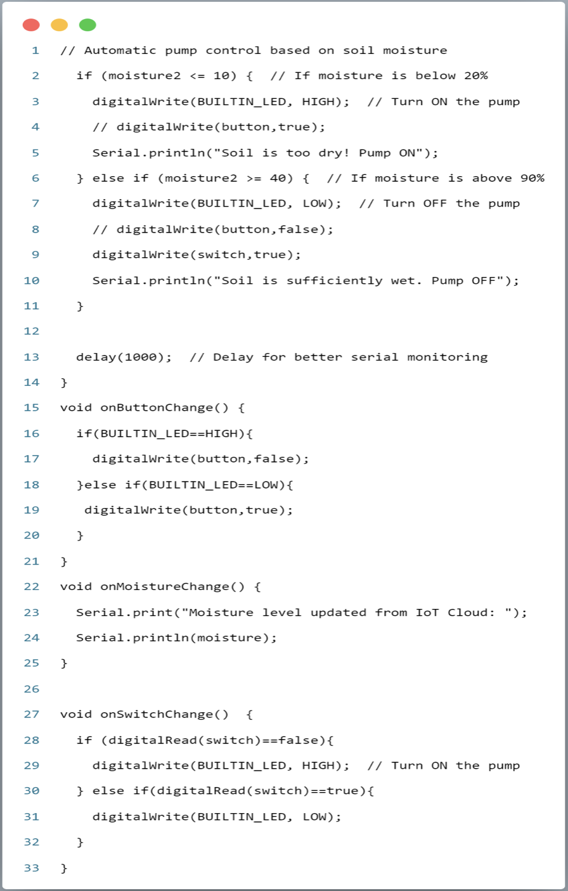
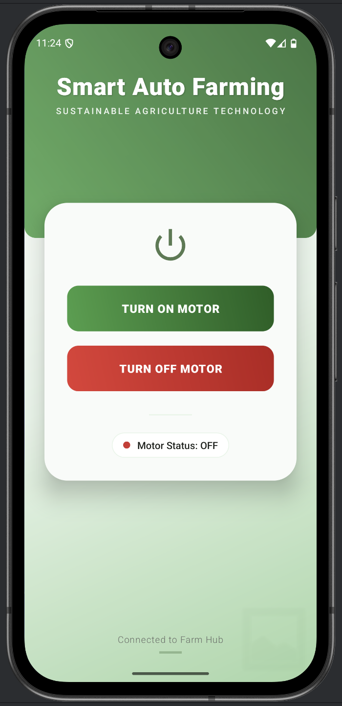

# 🌱 Smart Irrigation System (IoT Based)

[](https://www.espressif.com/en/products/socs/esp8266)
[](https://www.arduino.cc/)
[]()

## 🎯 Project Goal

The goal of this project is to develop a smart irrigation system that allows farmers to control water pumps remotely without physically visiting their farms. 

The system provides a simple application interface where the user can turn the motor ON or OFF with a single click. When the user performs an action, a request is sent to the server, which then communicates with the IoT device installed on the farm. The device receives the command and activates or deactivates the water pump accordingly.

This solution helps farmers save time, reduce manual effort, and improve efficiency by enabling real-time remote control of irrigation systems.

---

## 📖 Table of Contents
- [✨ Key Features](#-key-features)
- [🛠️ Technologies Used](#-technologies-used)
- [📦 Hardware Components](#-hardware-components)
- [⚙️ Working Principle](#-working-principle)
- [💻 Software Implementation](#-software-implementation)
- [🔌 Circuit Diagram](#-circuit-diagram)
- [🖼️ Project Demo](#-project-demo)
- [📱 Mobile Application](#-mobile-application)
- [🚀 Installation & Setup](#-installation--setup)
- [🔮 Future Improvements](#-future-improvements)
- [👤 Author](#-author)

---

## ✨ Key Features
- **Real-time Monitoring:** Continuously tracks soil moisture levels.
- **Automatic Irrigation:** Automatically turns the water pump ON/OFF based on predefined moisture thresholds.
- **Water Conservation:** Prevents over-watering by only irrigating when necessary.
- **Low Power Consumption:** Optimized for long-term deployment.
- **Beginner-Friendly:** Simple circuit design and well-documented code.

---

## 🛠️ Technologies Used
- **Programming Language:** C++ (Arduino Framework)
- **IoT Platform:** ESP8266 / Arduino / ESP32
- **IDE:** Arduino IDE / VS Code with PlatformIO
- **Protocol:** Serial / MQTT (Optional for remote monitoring)

---

## 📦 Hardware Components
The following core components are used in this project:
- **Microcontroller:** ESP8266 (NodeMCU) or Arduino Uno.
- **Sensor:** Soil Moisture Sensor (Capacitive recommended).
- **Actuator:** 5V DC Mini Submersible Water Pump.
- **Controller:** 5V Relay Module.
- **Power:** 5V DC Power Supply / USB.

> [!NOTE]
> For a detailed list of all components with sourcing links, check the [components-list.md](hardware/components-list.md).

---

## ⚙️ Working Principle
1. **Sensing:** The Soil Moisture Sensor is inserted into the plant's soil. It measures the moisture level by detecting the electrical resistance (or capacitance) between its probes.
2. **Processing:** The sensor sends an analog signal to the microcontroller. The microcontroller maps this signal to a percentage value (0% for dry, 100% for wet).
3. **Decision Making:** The code compares the current moisture percentage against a set threshold (e.g., 30%).
4. **Action:**
   - If **Moisture < Threshold**: The microcontroller sends a signal to the Relay, which completes the circuit and turns the **Water Pump ON**.
   - If **Moisture > Threshold**: The microcontroller stops the signal, the Relay disconnects, and the **Water Pump turns OFF**.
5. **Feedback:** The status can be monitored via the Serial Monitor or an optional LCD display/Web Dashboard.

---

## 💻 Software Implementation

This project includes two versions of the code:

### **Code 1: Basic Automatic Irrigation**
This version works locally without the internet. It's perfect for a simple, reliable offline setup.



```cpp
// Basic Soil Moisture Monitoring & Pump Control
void loop() {
  int moisture = analogRead(A0);
  int percent = map(moisture, 1024, 200, 0, 100);

  if (percent < 30) digitalWrite(RELAY, HIGH); // Dry
  else if (percent > 70) digitalWrite(RELAY, LOW); // Wet
  delay(5000);
}
```
> [View Full Code 1](software/arduino-code/smart-irrigation.ino)

### **Code 2: IoT-based Irrigation (Blynk)**
This version allows you to monitor soil moisture and control the pump from your smartphone anywhere in the world.



```cpp
// IoT Version using Blynk App
void sendSensorData() {
  int percent = map(analogRead(A0), 1024, 200, 0, 100);
  Blynk.virtualWrite(V1, percent); // Send data to Mobile App
  if (percent < 30) {
    digitalWrite(RELAY, HIGH);
    Blynk.logEvent("soil_dry", "Watering started!");
  }
}
```
> [View Full Code 2](software/arduino-code/smart-irrigation-iot.ino)

---

## 🔌 Circuit Diagram
> [!IMPORTANT]
> A high-resolution circuit diagram will be uploaded soon. For now, refer to the wiring description below:
> - **Sensor VCC/GND** → Microcontroller 3.3V/GND
> - **Sensor Signal** → Microcontroller A0 (Analog Pin)
> - **Relay VCC/GND** → Microcontroller 5V/GND
> - **Relay IN** → Microcontroller D1 (Digital Pin)
> - **Pump** → Connected via Relay's NO (Normally Open) contact to Power Supply.

*(Placeholder for Circuit Diagram Image)*


---

## 🖼️ Project Demo
*(Placeholder for Project Images)*
| Working Setup | Real-time Demo |
| :---: | :---: |
|  |  |

---

## 📱 Mobile Application

Monitor and control your plants from your smartphone. Use the **Blynk App** (available on iOS and Android) to create a custom dashboard.

### **App Screenshots**



| Dashboard View | Real-time Monitoring | Pump Control |
| :---: | :---: | :---: |
|  |  |  |

> [!NOTE]
> Create a Blynk project, get your Auth Token, and update the [Code 2](software/arduino-code/smart-irrigation-iot.ino) to get started.

---

## 🚀 Installation & Setup
Follow these steps to get your Smart Irrigation System up and running:

1. **Hardware Assembly:**
   - Follow the wiring description in the [Circuit Diagram](#-circuit-diagram) section.
   - Ensure all connections are secure and the pump is submerged in water.

2. **Software Setup:**
   - Install the [Arduino IDE](https://www.arduino.cc/en/software).
   - Clone this repository:
     ```bash
     git clone https://github.com/atharvpokale/Smart-Irrigation-System.git
     ```
   - Open the `.ino` file in the `software/arduino-code/` directory.
   - Select your board (e.g., NodeMCU 1.0) and the correct COM port.
   - Click **Upload**.

3. **Calibration:**
   - Open the Serial Monitor (Baud rate: 115200).
   - Note the values when the sensor is completely dry and when it's in water.
   - Update the `DRY_VALUE` and `WET_VALUE` in the code for better accuracy.

---

## 🔮 Future Improvements
- [ ] **Mobile App Integration:** Add a Flutter or React Native app for remote monitoring.
- [ ] **Web Dashboard:** Build a real-time dashboard using MQTT and Node.js.
- [ ] **Solar Powered:** Implement a solar panel for a truly autonomous system.
- [ ] **Multi-plant Support:** Add multiple sensors and solenoid valves for multiple plants.
- [ ] **Weather Integration:** Use OpenWeatherMap API to skip watering if rain is predicted.

---

## 👤 Author
**Atharv Pokale**
- LinkedIn: [Your Profile](https://linkedin.com/in/yourprofile)


> [!TIP]
> **Star this repo** if you find it helpful! ⭐
